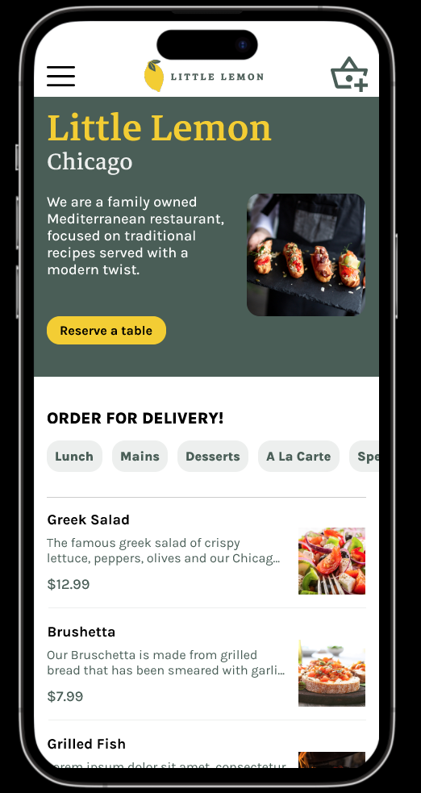
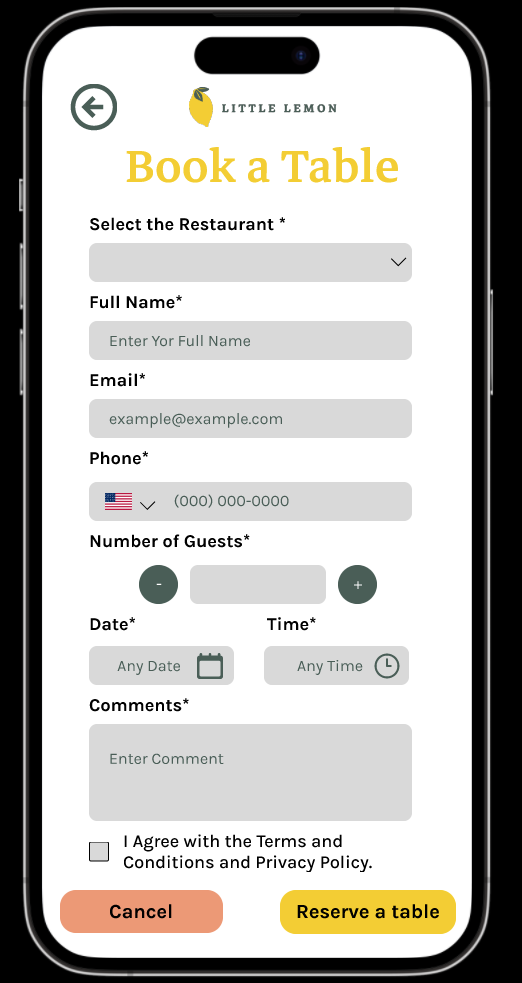
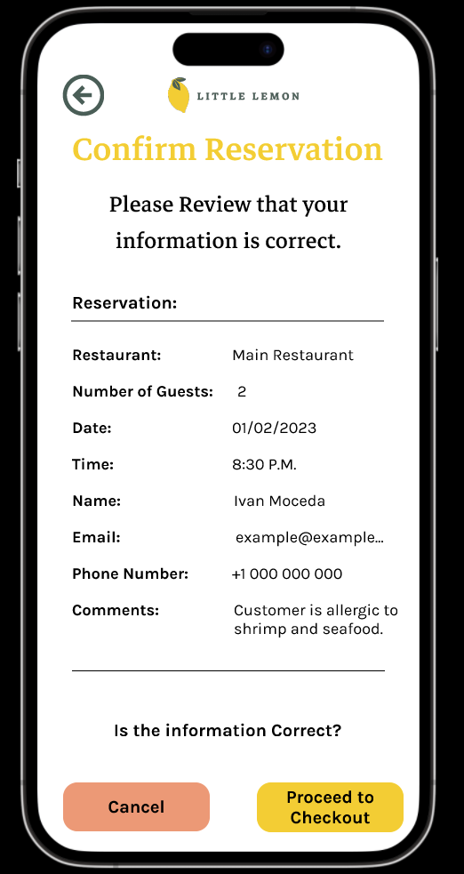
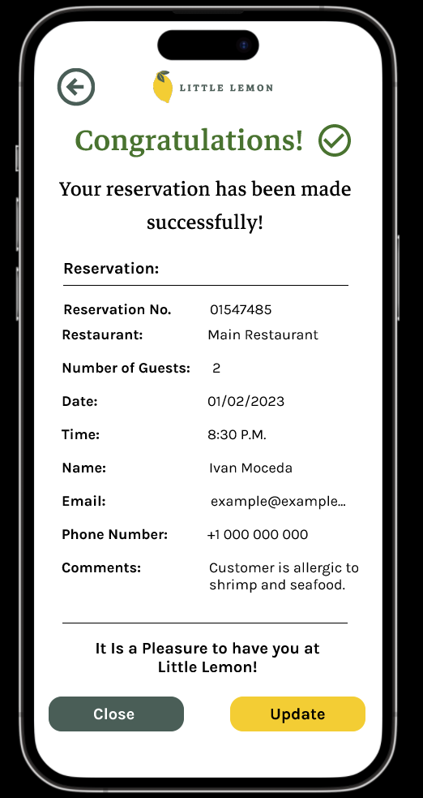
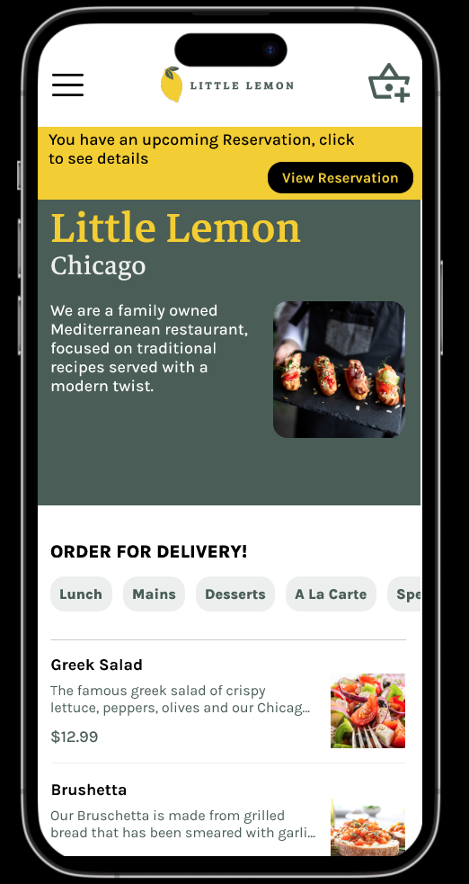

# Booking Table UX/UI Project
The project contains the UX/UI design for a Table Reservation feature for a Restaurant WebApp.

## Application Description

This project was created for the Principles of UX/UI Design FrontEnd Meta certification. Its purpose is to understand and have experience in designing User Personas, Journey Maps, Wireframes, and Prototypes.  The files describe the whole process for the UX/UI design for a Table Reservation feature for a Restaurant WebApp.

In the repository, the user can find the Figma files and a pdf with the share links for each file to visualize it directly on the Figma Application.

## Links

**Problem Statement**
Little Lemon is a small restaurant that has been expanding over the years due to its
experience and dishes. In an effort to enhance the operations of the establishment, the
company needs an online reserve-a-table feature on its website, so the clients can
ensure their reservation from their smart devices/computers whenever they want. This
feature will allow the staff to identify the number of customers per hour and attract
newcomers. With the aforementioned statement, the user story that results is: “As a
User, I want to be able to reserve a table from my smartphone, so I can do it whenever
and wherever I want.”

**User Persona**
https://www.figma.com/file/745L3wnyqLNczvwW3F9oeZ/User-Persona?t=FHFufnYVMkz80eDW-1

**Journey Map**
https://www.figma.com/file/KPZYsYJcGyKYhpRRmE9Rw3/CustomerJourneyMap?t=FHFufnYVMkz80eDW-1

**Wireframes**
https://www.figma.com/file/Ls8rYPTMhRUT4mYe45PlVI/BookTableWireframe?nodeid=0%3A1&t=63HO722tcqqm8Pk2-1

**Prototype**
*Prototype Mode:*
https://www.figma.com/proto/wZtOv0FGxgL7XVxh06t1Ed/BookTablePrototype?scaling=scale-down&page-id=0%3A1&starting-point-node-id=23%3A330&node-id=1-36

*Prototype:*
https://www.figma.com/file/wZtOv0FGxgL7XVxh06t1Ed/BookTablePrototype?t=FHFufnYVMkz80eDW-1